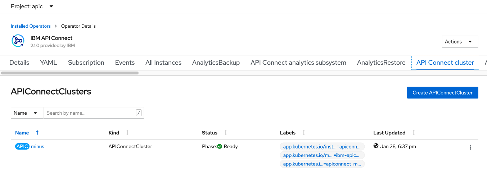
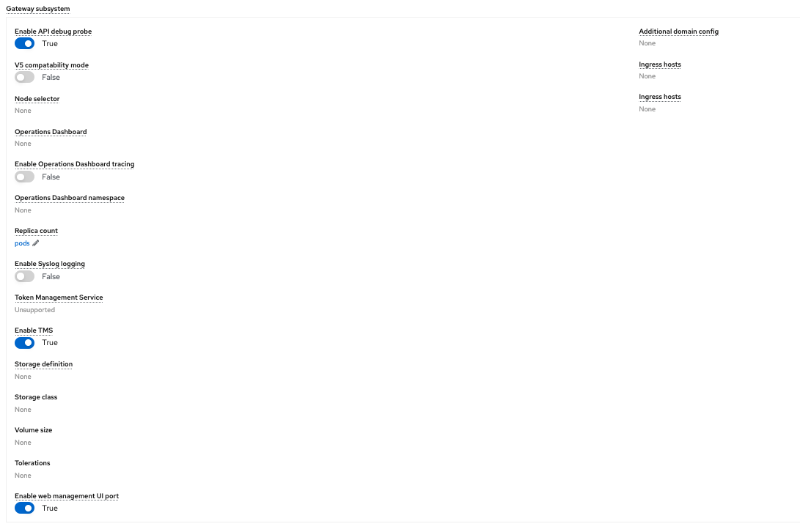
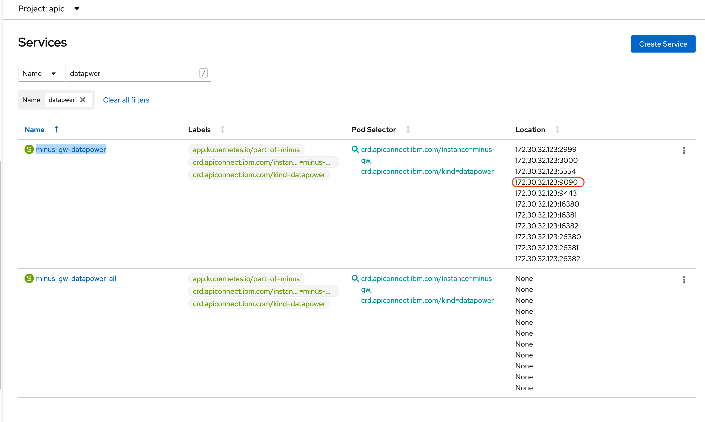
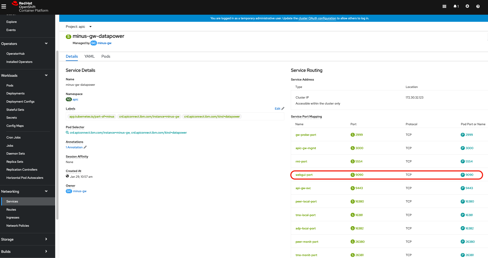
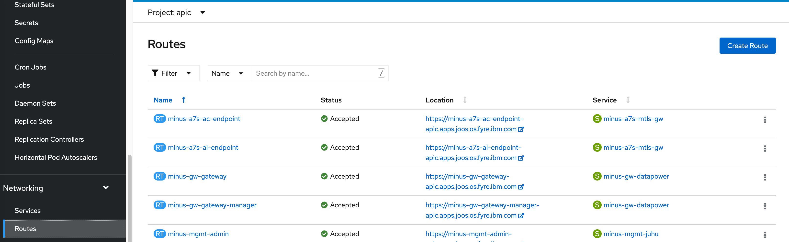
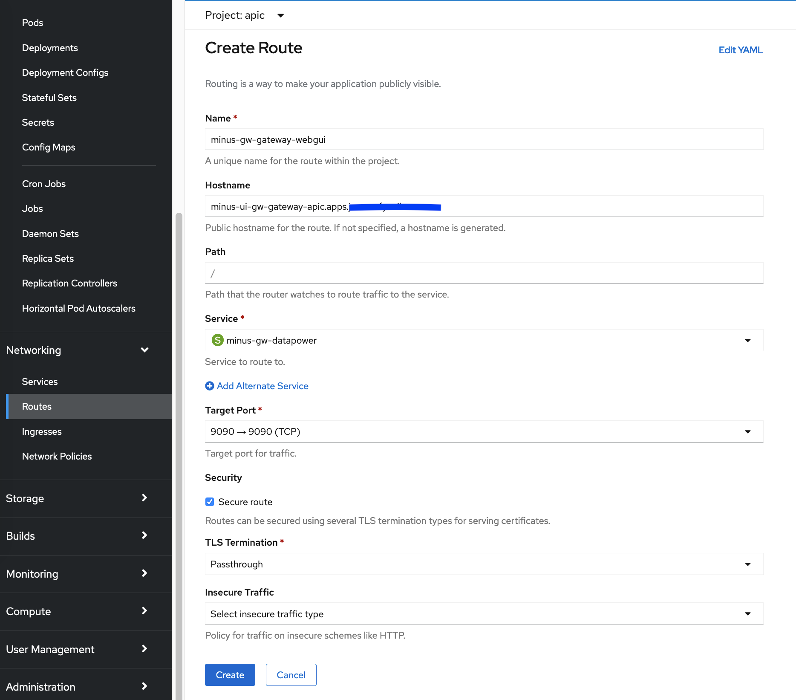

## How to enable the IBM DataPower Web GUI on an Openshift deployment

### Question
I have deployed IBM DataPower on Openshift 4.x environment and would like to know what are the steps necessary to enable the IBM DataPower admination webgui 

### Answer
#### 1. Enable the webgui port
The first steps is to enable the port. For this you have two possible options:

##### <u>Option 2</u> - Directly in the `apiconnectcluster` CR:
1. In your namepsace, go to the Installed Operators and select `IBM API Connect` 

2. Navigate to the API Connect cluster
> 

3. Click on the `APIConnectCluster` CR instance (i.e minus as show in the screenshot above)
4. Scroll to the `Gateway subsystem` section.

5. Set the `Enable web management UI port` to `True` using the toggle and `Confirm the change`
> 

6. As nalternative to step 4 & 5, you can direct edit the yaml file and add the `webGUIManagementEnabled: true` to the `gateway spec` as show below

```
spec:
  gateway:
    adminUser: {}
    apiDebugProbe: true
    apicGatewayPeeringTLS: {}
    apicGatewayServiceTLS: {}
    gatewayEndpoint: {}
    gatewayManagerEndpoint: {}
    tokenManagementService:
      enabled: true
    webGUIManagementEnabled: true
```

##### <u>Option 2</u> - Manually accessing and changing the configuration at the pod level:

1. Access the dynamic gateway pod with the command:
```
oc attach -it <gateway-pod-name> -n <namespace>
login: admin
Password: ******** (admin by default)
```
2. Enter the configuration mode with
```
idg# co
```
3. Enable the web-management and ssh objects
```
idg(config)# web-mgmt 0 9090
idg(config)# ssh 0 9022
idg(config)# write mem
Overwrite previously saved configuration? Yes/No [y/n]: yes
Configuration saved successfully.
```
4. Verify the change was done successfully
```
idg(config)# show web-mgmt
web-mgmt [up] (modified)
--------
 admin-state enabled
 ip-address 0.0.0.0
 port 9090
 save-config-overwrite on
 idle-timeout 9090 Seconds
 acl web-mgmt  [up]
 ssl-config-type server
```
 
```
idg(config)# show ssh
ssh [up] (modified)
---
 admin-state enabled 
 ip-address 0.0.0.0 
 port 9022 
 acl ssh  [up]
 ```

<u>_Note_</u>: This has to be be done each time the dymanic gateway pod restarts.

<br>

#### 2- Expose the port 9090

##### <u>Option 1</u> - Verify the port 9090 exists in gateway service from the CLI:

1. Get the services and grep for the one(s) exposing the port 9090 using the command: <br>
`oc get services -n <namespace> | grep 9090`
<br>
You should see something like:
```
# oc get services | grep  9090
minus-gw-datapower        ClusterIP   172.30.32.123  <none>    2999/TCP,3000/TCP,5554/TCP,9090/TCP,9443/TCP,16380/TCP,16381/TCP,16382/TCP,26380/TCP,26381/TCP,26382/TCP   92m
minus-gw-datapower-all    ClusterIP   None           <none>    2999/TCP,3000/TCP,5554/TCP,9090/TCP,9443/TCP,16380/TCP,16381/TCP,16382/TCP,26380/TCP,26381/TCP,26382/TCP   92m
```
if the no service exposes the port 9090, you can create a separate one see **optional part 4**.

##### <u>Option 2</u> - Verify the port 9090 exists in gateway service from OpenShift web console:

1. Expand the `Networking` section and go to the `Services`

2. Filter for the `'datapower'` services

3. Select the service with the `<apiconnectcluster-name>-gw-datapower` (e.g. `minus-gw-datapower`)
> 

and

> 


#### 3. Expose service by creating the route

##### <u>Option 1</u> - Create the route using the OpenShift web console:

1. Expand the `Networking` section and go to the `Routes`

2. Click on the `Create Route` button
> 

3. Fill in the route:
   1. **Name** : `<apiconnectcluster-name>-gw-gateway-webgui` (such as `minus-gw-gateway-webgui`)
   2. **Hostname** : `<apiconnectcluster-name>-ui-gw-gateway-apic.apps.<domain-name>` such as `minus-ui-gw-gateway-apic.apps.mydomain.ibm.com`). If the hostname is not speficed one will be automatically assigned.
   3. **Service**  available in the drop down list: `<apiconnectcluster-name>-gw-datapower` (e.g. `minus-gw-datapower` as seen in part 2)
   4. **Target Port*** available in the drop down list: `9090->9090(TCP)`
   5. Enable `Secure route`
   6. Set the `TLS Termination` to `Passthrough`
 
 > 

4. Click the 'Create' button


##### <u>Option 2</u> - Create using the route using the CLI: <br>

1. Get the service name that is exposing the 9090 port: <br>
`oc get services -n <namespace> | grep 9090` (see part 2 for further details)

2. Create the  passtrough route using the existing service <br>
`oc create route passthrough <route-name> --service=<service-name> --port=<port> --hostname=<hostname-you-want> -n <namespace>`

For example for an existing service named `minus-gw-datapower`, the command would be:<br>

`oc create route passthrough minus-gw-gateway-webgui --service minus-gw-datapower --port=9090 --hostname=minus-ui-gw-gateway-apic.apps.mydomain.ibm.com -n apic`
<br>

If the hostname is not speficed one will be automatically assigned and you get get it with the command:
`oc get route <route-name> -o jsonpath='{.spec.host}' -n <namespace>`
<br>
or
<br>
`oc get routes -n <namespace> | grep webgui`


### 4. <u>Optional</u>: Create a new service to expose the port 9090

From the OpenShift web console, click the plus button, create the service and paste the yaml content, such as the one below, you will create for your service.
You can as well go to the `Networking` section, go to the `Services` and create a service paste the same content.

```
kind: Service
apiVersion: v1
metadata:
  name: myservice-gateway-webgui
  namespace: <namespsace>
spec:
  ports:
    - protocol: TCP
      port: 9090
      targetPort: 9090
  selector:
    app.kubernetes.io/instance: <namespsace>-<datapower-instance-name>
    app.kubernetes.io/name: datapower
  type: ClusterIP
  sessionAffinity: None
  ```

For example for a namespace `apic` and a datapower gateway cluster instance named `minus-gw`, that you can be retrieved with the command: `oc get gatewaycluster -n apic`, the content of the yaml for the service would be:

```
kind: Service
apiVersion: v1
metadata:
  name: myservice-gateway-webgui
  namespace: apic
spec:
  ports:
    - protocol: TCP
      port: 9090
      targetPort: 9090
  selector:
    app.kubernetes.io/instance: apic-minus-gw
    app.kubernetes.io/name: datapower
  type: ClusterIP
  sessionAffinity: None
  ```


<br>

  <u>**NOTA BENE**</u>: <br>When this document was written, the version of API Connect used was **10.0.0.0** or **higher** on an Openshift 4.6.x
