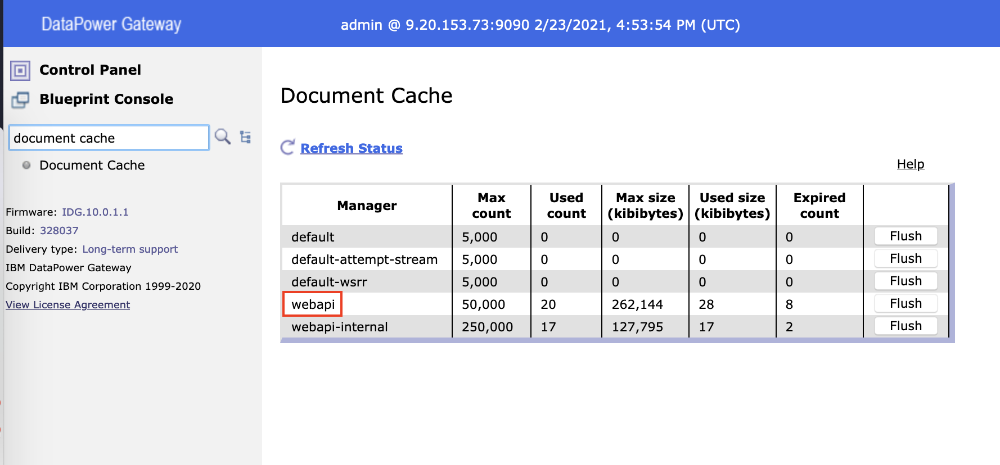
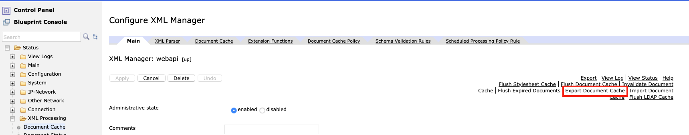
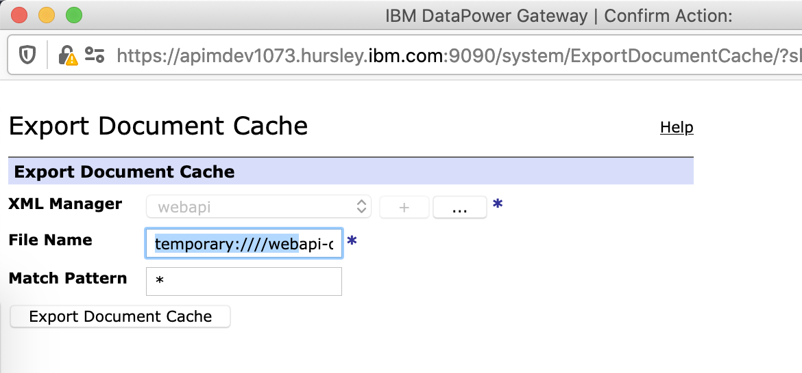
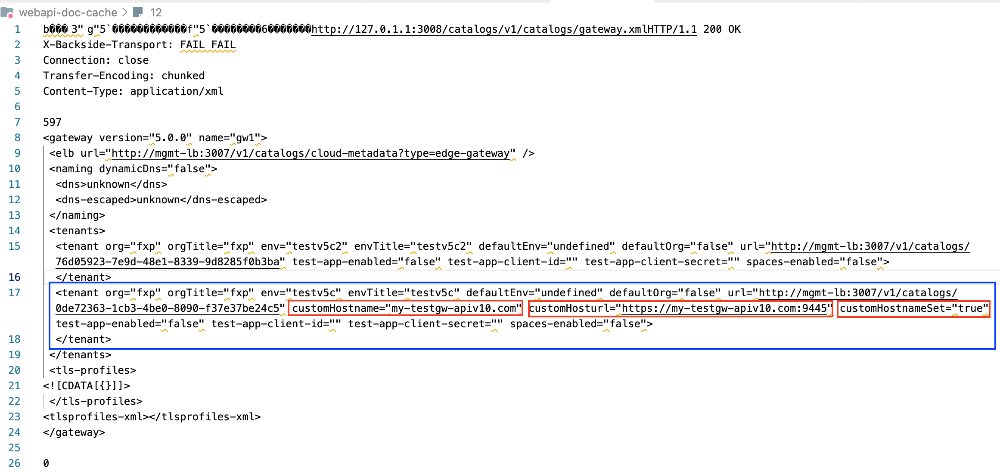

## How to retain Version 5 vanity endpoint behavior for a given Catalog in API Connect v10.0.x

### Version 5 Background

In the API Connect V5 version, you may have use the option to modify the gateway endpoint at which the API is invoked using the feature call called `host to catalog mapping`.<br>
This gave the ability to call an API without supplying the provider organization and Catalog name in the URL. <br>
In other words change the default `https://{gateway-cluster-service-hostname}/{organization}/{catalog}` url to be `https://{gateway-custom-hostname}}`. <br>
(see knowledge center page: https://www.ibm.com/support/knowledgecenter/SSMNED_5.0.0/com.ibm.apic.apionprem.doc/create_env_507.html).

### V10 Vanity endpoint setup 
When moving to API Connect version 10, you may want to retain this ability but for this there are a few of steps that you need to follow. <br>
The required steps are outlined in the following documentation page: <br>
https://www.ibm.com/support/knowledgecenter/SSMNED_v10/com.ibm.apic.apionprem.doc/tapic_catalog_endpoint_v5_retain.html. <br>

In addition to these steps, I will outline here are some considerations, checks and tips I came accross which helped me to successfully use the feature and/or troubleshoot why it was not working.

#### Consideration 1: Vanity API Enpoint or V5 Legacy substitution

You cannot set the `Vanity Api Endpoint` in the catalog settings, using the UI, and set the `v5_endpoint_substitution_behavior` at the same time.<br>
It is one or the other but **not both** otherwise you get the following message:

> Error - A catalog can support only one type of endpoint behaviour. Only one of 'v5_endpoint_substitution_behavior' or 'vanity_api_endpoint' can be set to 'enabled'.

If you check the catalog settings with the Toolkit CLI command <br>

`apic catalog-settings:get --server mgmt_endpoint_url --catalog catalog_name --org organization_name --output -`

Here is an exmaple on what the command will return (for a DataPower Gateway v5 compatible that will be discussed in a later point)

```
type: catalog_setting
api_version: 2.0.0
name: catalog-setting
user_registry_default_url: >-
  https://{{my-mgmt-hostname}}.ibm.com/api/catalogs/9447ea86-a715-4299-a4e4-c6285fbd6ab6/0de72363-1cb3-4be0-8090-f37e37be24c5/configured-catalog-user-registries/5aeb0648-257d-4ab4-a0c8-d2076529e140
production_mode: false
portal:
  type: none
product_lifecycle_approvals: []
task_self_approval: false
application_lifecycle:
  enabled: false
consumer_self_service_onboarding: true
invitation_ttl: 172800
legacy_endpoint_behavior: enabled
v5_endpoint_substitution_behavior:
  base_endpoints:
    - endpoint: 'https://my-testgw-apiv10.com:9445'
      gateway_service_url: >-
        https://{{my-mgmt-hostname}}.ibm.com/api/catalogs/9447ea86-a715-4299-a4e4-c6285fbd6ab6/0de72363-1cb3-4be0-8090-f37e37be24c5/configured-gateway-services/8336cf3d-d6f4-4c2a-9d35-c665c4115e7c
vanity_api_endpoint:
  enabled: false
  vanity_api_base_endpoints: []
spaces_enabled: false
custom_notification_templates_enabled: false
email_sender:
  custom: false
hash_client_secret: false
created_at: '2021-02-23T15:07:23.000Z'
updated_at: '2021-02-23T15:19:56.000Z'
org_url: >-
  https://{{my-mgmt-hostname}}.ibm.com/api/orgs/9447ea86-a715-4299-a4e4-c6285fbd6ab6
catalog_url: >-
  https://{{my-mgmt-hostname}}.ibm.com/api/catalogs/9447ea86-a715-4299-a4e4-c6285fbd6ab6/0de72363-1cb3-4be0-8090-f37e37be24c5
url: >-
  https://{{my-mgmt-hostname}}.ibm.com/api/catalogs/9447ea86-a715-4299-a4e4-c6285fbd6ab6/0de72363-1cb3-4be0-8090-f37e37be24c5/settings
```
Notice that the **`vanity_api_endpoint`** is not enabled while **`legacy_endpoint_behavior`** is.


#### Consideration 2 : DataPower Gateway v5 compatible

#### 1-Setup:
With a **DataPower Gateway v5 compatible**, the **hostname** used in the URL needs to be **different** from the one of the Gateway service. <br>

For example, if the **API invocation endpoint** of the DataPower gateway service, in the admin Cloud Manager, is: `https://my-apigateway-service-hostname.ibm.com:9445` then the **`endpoint`**, in your YAML file, **must not use** the hostname **`my-apigateway-service-hostname.ibm.com`** but rather something else such as: **`my-testgw-apiv10.com`**. 

Example of yaml file:

```
legacy_endpoint_behavior: enabled
v5_endpoint_substitution_behavior:
  base_endpoints:
    - endpoint: https://my-testgw-apiv10.com:9445
      gateway_service_url: https://{{my-mgmt-hostname}}.ibm.com/api/catalogs/9447ea86-a715-4299-a4e4-c6285fbd6ab6/0de72363-1cb3-4be0-8090-f37e37be24c5/configured-gateway-services/8336cf3d-d6f4-4c2a-9d35-c665c4115e7c
  unenforced_api_base_endpoint: ''
```

where **`gateway_service_url`** is retrieved using th the Toolkit CLI command:

`apic configured-gateway-services:list --scope catalog --catalog catalog_name --server mgmt_endpoint_url --org organization_name`

#### 2-Checking that the gateway was correctly updated and will recognize the customhostname to retaim the version 5 behavior.

The DataPower Gateway document cache will contain the information whether the customhostname information from the `v5_endpoint_substitution_behavior` settings was correctly pushed from the management server.
You can export the document cache using the DataPower 
1. CLI:<br>
   Type the commmands: <br>
   `co; sw {{APIM-domain-name}};` <br>
   `export-document-cache webapi temporary://webapi-doc-cache.zip`

2. WebGUI:<br>
   1. 1. Go/Switch to your apiconnect domain
   
   2. Search for `Document Cache` and click on `webapi`:

      
   
   3. Click on the `Export the document cache` link
    
      

   4. In the export Document cache pop up, specify the `File name`: `temporary:////webapi-doc-cache.zip` and click on the 'Export document Cache' button.
    
      
  
   5. Confirm when asked and once the file was successfully exported, go to the `File Management` and navigate to the `temporary` directory to retrive the `webapi-doc-cache.zip` file created.
   
   6. Save the zip file on your file system and unzip it.
   
   7. You will see a serie of files named 1, 2, 3, etc ... Open each file, one after the other, till you see one where the `org`/`orgTitle` and `env`/`envTitle` will show something like:

       

       where you see two catalogs `testv5c` and `testv5c2` belonging to the provider organigation `fxp`.<br>In one outlined, (testv5c), we have enabled the `legacy_endpoint_behavior` with the endpoint substition as specified in the yaml file above.<br> 
       As a result it is having the `customHostname` set to `my-testgw-apiv10.com` and the `customHostnameSet` set to `true`. <br>
      
      **Nota Bene**: <br>
       If the **`customHostnameSet`** propperty is set to **`false`**, it means that the hostname specified for the `endpoint` property, in the yaml file used with the Toolkit, is the same as the one used for the Gateway Service registration in the Cloud manager topology.


#### Consideration 3 : DataPower API Gateway


<br>
Finally, at the time of writting this article, the API Connect version 5 feature to set, within a provider organisation, a catalog to be the default (and shorten the URL by omitting the catalog name), is not available in API Connect v10.x. <br>
See RFE: https://www.ibm.com/developerworks/rfe/execute?use_case=viewRfe&CR_ID=147147


