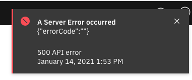

## Why invoking an API in the IBM API Connect Test tab fails with errors ?

## Problem

Online APIs (i.e. automatically published in the Sandbox) can be invoked from the Test tab of the API in the `Develop` (drafts) section of the API Connect Designer UI.<br> 

If the Data Power Gateway was not configured correctly you could see errors such:<br>
**500 API Error: {"errorCode":""}** or **400 Bad Request: ["Failed to create the capture setting."]** while testing or even not be able to test at all.


## Diagnostic

For example with 'OpenAPI 3.0 APIs and the following steps:

1. In the Develop Section, click on 'Add-> API' button and choose 'OpenAPI 3.0' tab
2. Select the option 'From target Service' and click next
3. Enter the Name and Target Service URL (for example https://httpbin.org/ip)
4. Once the API creation is finished, Set the toggle, on the top right, from 'offline' to 'online'.
5. In the Test tab, that will appear after the publishing has completed, click on the 'send' button.

Result:
You get the following error thrown: <br>

  


Inspecting the apim pod logs, you see:
```
2021-01-14T11:22:34.014Z audit [a0ffc7aa04963e2d9264186ebf447167] START: >>>>>>>> [GET]: /api/catalogs/9447ea86-a715-4299-a4e4-c6285fbd6ab6/sandbox/apis/testipopenapiv3/1.0.0
2021-01-14T11:22:34.035Z audit [a0ffc7aa04963e2d9264186ebf447167] END:   <<<<<<<< Successful: [200] response (GET:/api/catalogs/9447ea86-a715-4299-a4e4-c6285fbd6ab6/sandbox/apis/testipopenapiv3/1.0.0)  (took 21ms)
2021-01-14T11:22:34.035Z apicutil:profile:metrics [a0ffc7aa04963e2d9264186ebf447167] ;GET;/api/catalogs/9447ea86-a715-4299-a4e4-c6285fbd6ab6/sandbox/apis/testipopenapiv3/1.0.0;20.87156307697296;5.2660969495773315;4;1;1;0
2021-01-14T11:22:38.152Z audit [65d224be968ecd5580f0c75ef27a5f63] START: >>>>>>>> [POST]: /api/catalogs/fxp/sandbox/configured-gateway-services/gateway-service-1/assembly-debug
2021-01-14T11:22:38.637Z apim:error [65d224be968ecd5580f0c75ef27a5f63] Non-200 response creating gateway assembly debug: {"errorCode":""}
2021-01-14T11:22:38.639Z bhendi:error [65d224be968ecd5580f0c75ef27a5f63] Error in POST post:/api/catalogs/:org/:catalog/configured-gateway-services/:configuredgatewayservice/assembly-debug (assembly_debug.js:create)
  - status : 500
  - message: {"errorCode":""}
  - stack  : Error: {"errorCode":""}
    at error (/app/node_modules/apic-util/src/util.js:824:11)
    at AssemblyDebug.originalGatewayException (/app/routes/assembly_debug.js:372:15)
    at AssemblyDebug.create (/app/routes/assembly_debug.js:115:18)
    at runMicrotasks (<anonymous>)
    at processTicksAndRejections (internal/process/task_queues.js:97:5)
    at async dispatch (/app/node_modules/bhendi/mw/dispatcher.js:415:20)
    at async dispatcher (/app/node_modules/bhendi/mw/dispatcher.js:328:5)
  - errors : undefined: {"status":500,"message":["{\"errorCode\":\"\"}"]}
2021-01-14T11:22:38.640Z audit [65d224be968ecd5580f0c75ef27a5f63] Stack trace for response error: Error: {"errorCode":""}
    at error (/app/node_modules/bhendi/lib/bhendiUtil.js:59:11)
    at dispatch (/app/node_modules/bhendi/mw/dispatcher.js:530:21)
    at runMicrotasks (<anonymous>)
    at processTicksAndRejections (internal/process/task_queues.js:97:5)
    at async dispatcher (/app/node_modules/bhendi/mw/dispatcher.js:328:5)
[65d224be968ecd5580f0c75ef27a5f63] {
    "status": 500,
    "message": [
        "{\"errorCode\":\"\"}"
    ]
}
2021-01-14T11:22:38.640Z audit [65d224be968ecd5580f0c75ef27a5f63] END:   <<<<<<<< FAILURE: [500] response (POST /api/catalogs/fxp/sandbox/configured-gateway-services/gateway-service-1/assembly-debug) (took 488ms)
2021-01-14T11:22:38.640Z apicutil:profile:metrics [65d224be968ecd5580f0c75ef27a5f63] ;POST;/api/catalogs/fxp/sandbox/configured-gateway-services/gateway-service-1/assembly-debug;487.8745720386505;22.15603256225586;10;1;6;1
2021-01-14T11:22:38.641Z bhendi:server [65d224be968ecd5580f0c75ef27a5f63]   - Serializing as application/json
```

   Or     
     
  ![Status 400 : message  ["Failed to create the capture setting."]](./images/APITestingError400.png)

```
2021-01-20T19:34:13.625Z apim:error [47e8be842f18202789702aa987206f7d] Non-200 response creating gateway assembly debug: {"_links":{"self":{"href":"/mgmt/actionqueue/apiconnect"}},"error":["Failed to create the capture setting."]}
2021-01-20T19:34:13.628Z bhendi:error [47e8be842f18202789702aa987206f7d] Error in POST post:/api/catalogs/:org/:catalog/configured-gateway-services/:configuredgatewayservice/assembly-debug (assembly_debug.js:create)
  - status : 400
  - message: ["Failed to create the capture setting."]
  - stack  : Error: ["Failed to create the capture setting."]
    at error (/app/node_modules/apic-util/src/util.js:824:11)
    at AssemblyDebug.originalGatewayException (/app/routes/assembly_debug.js:372:15)
    at AssemblyDebug.create (/app/routes/assembly_debug.js:115:18)
    at runMicrotasks (<anonymous>)
    at processTicksAndRejections (internal/process/task_queues.js:97:5)
    at async dispatch (/app/node_modules/bhendi/mw/dispatcher.js:415:20)
    at async dispatcher (/app/node_modules/bhendi/mw/dispatcher.js:328:5)
  - errors : undefined: {"status":400,"message":["[\"Failed to create the capture setting.\"]"]}
2021-01-20T19:34:13.629Z audit [47e8be842f18202789702aa987206f7d] Stack trace for response error: Error: ["Failed to create the capture setting."]
    at error (/app/node_modules/bhendi/lib/bhendiUtil.js:59:11)
    at dispatch (/app/node_modules/bhendi/mw/dispatcher.js:530:21)
    at runMicrotasks (<anonymous>)
    at processTicksAndRejections (internal/process/task_queues.js:97:5)
    at async dispatcher (/app/node_modules/bhendi/mw/dispatcher.js:328:5)
2021-01-20T19:34:13.629Z audit [47e8be842f18202789702aa987206f7d] END:   <<<<<<<< FAILURE: [400] response (POST /api/catalogs/fxp/sandbox/configured-gateway-services/gateway-service-1/assembly-debug) (took 7211ms)
[47e8be842f18202789702aa987206f7d] {
    "status": 400,
    "message": [
        "[\"Failed to create the capture setting.\"]"
    ]
}
2021-01-20T19:34:13.629Z apicutil:profile:metrics [47e8be842f18202789702aa987206f7d] ;POST;/api/catalogs/fxp/sandbox/configured-gateway-services/gateway-service-1/assembly-debug;7211.411416053772;13.647608041763306;9;1;6;1
2021-01-20T19:34:13.629Z bhendi:server [47e8be842f18202789702aa987206f7d]   - Serializing as application/json
```


## Resolution
To resolve the first error, you need to enable the **REST Management Interface** on the default domain and, for the second one, enable the **API Probe settings** in your **apiconnect domain**.<bR>
Without these settings, you will not be use the Test functionalities with your APIs.

For Kubernetes environment it is enabled by default but for **ova** it is not.

See the [Preparing an API for debugging with the Test tab](https://www.ibm.com/docs/en/api-connect/10.0.1.x?topic=api-preparing-debugging-test-tab) topic of the IBM Documentation:

**The DataPower API Gateway is configured to support the API probe**

> To enable the Test tab's trace feature, the DataPower API Gateway must be configured to support gateway peering and the gateway probe. In a gateway service running in Kubernetes, the API probe is automatically enabled. In a gateway service running external to Kubernetes, the DataPower configuration must be added to the application domain supporting API Connect. Check with your administrator to confirm that gateway peering and the gateway probe are enabled as explained in [Configuring DataPower API Gateway](https://www.ibm.com/docs/en/api-connect/10.0.1.x?topic=connect-configuring-datapower-api-gateway)

  See the step 3 **Optional: Enable the REST management interface in the default domain**
>The REST management interface is required if you want to enable to the Trace feature in the assembly Test tab in the API Manager.

 and the step 18 **Configure the gateway peering object for the API probe**.
>In order for API Connect to receive trace data in the Test tab's debugger, the DataPower API Gateway must be configured to support the API probe.
  

<br>
After you have done this, you should be able to test your API succesfully.

<br>
<br>


<u>**NOTA BENE**</u>: <br>The steps outlined in this document were tested with the versions **10.0.1.1** of API Connect. Although they should be valid with all **10.0.0.x** versions, it was not tested with all of them.